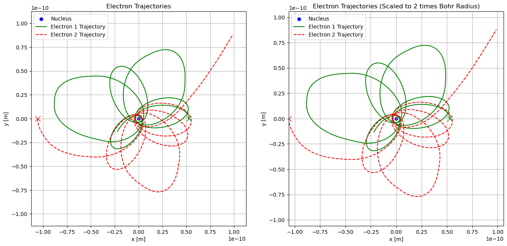

# Saturnian Atomic Model

Numerical simulation of a simplified “Saturnian” atomic model, tracking the motion of electrons orbiting a fixed atomic nucleus under Coulomb forces. The simulation can handle multiple electrons, calculate their energies, track orbital eccentricities, and determine when orbits become unstable.

## Overview

This project models electrons orbiting an atomic nucleus in a two-dimensional plane under the influence of Coulomb forces. The goal is to investigate orbital dynamics, stability, and the evolution of eccentricity for systems of one or more electrons.

The model considers electrons in either a single shell or in multiple orbital shells (currently supporting up to two shells), with initial positions and tangential velocities calculated to produce circular or near-circular orbits. The code tracks the evolution of each electron’s orbit, including:
- Minimum and maximum orbital radius
- Orbital eccentricity
- Kinetic, potential, and total energy

The simulation stops when any electron becomes unbound (eccentricity above threshold), crashes into the nucleus (distance below threshold), or exceeds a defined energy threshold. The framework is modular and can be adapted to different numbers of electrons, orbital shells, or simulation parameters.

## Methods

The project implements a generalized 2D physics simulation framework in Python for modeling Coulombic interactions and orbital stability. Key components include:
- Saturnian_Atomic_Simulation class: Encapsulates the state of the atomic system, including electron positions, velocities, angular positions, min/max distances, eccentricity, and energies. Contains functions for computing forces, energies, and orbital parameters.
- create_state0 function: Generates the initial state vector for n electrons, with optional multiple orbital shells, properly spaced angular positions, and tangential velocities.
- Numerical Integration: Uses scipy.integrate.solve_ivp to solve the system of ODEs for electron motion under Coulomb forces, with event detection for energy, eccentricity, and crash thresholds.
- Event Functions: Monitors orbital stability, energy thresholds, and potential electron crashes, stopping the simulation when critical conditions are met.
- Visualization: Functions to plot electron trajectories, orbital eccentricities, and energies over time, including zoomed-in views around the nucleus.

## Repository Structure

```plaintext
saturnian-atomic-orbit/
├── saturnian_atomic_simulation.py  # Core classes and functions for simulation
├── saturnian_orbit_analysis.ipynb  # Notebook to run simulations and generate plots
├── figures/                        # Plots generated from simulations
└── README.md                       # This file
```

## Requirements

Required Python libraries include:
- Python 3
- Numpy
- Matplotlib
- Scipy

## How to Run

Open saturnian_orbit_analysis.ipynb and run all cells to simulate the system and generate plots of electron trajectories, eccentricity, and energy over time.

For custom simulations:
1. Modify parameters in create_state0 to define number of electrons, orbital shells, and initial velocities.
2. Instantiate the Saturnian_Atomic_Simulation class with the desired state, charge, mass, and nucleus configuration.
3. Call run_simulation() with desired start time, maximum simulation time, and solver tolerances.
4. Use the plotting functions (plot_trajectories, plot_stability, plot_eccentricities, plot_energies) to visualize the results.

The code is modular and designed to allow easy experimentation with different atomic numbers, orbital configurations, and simulation parameters.

## Example Output


